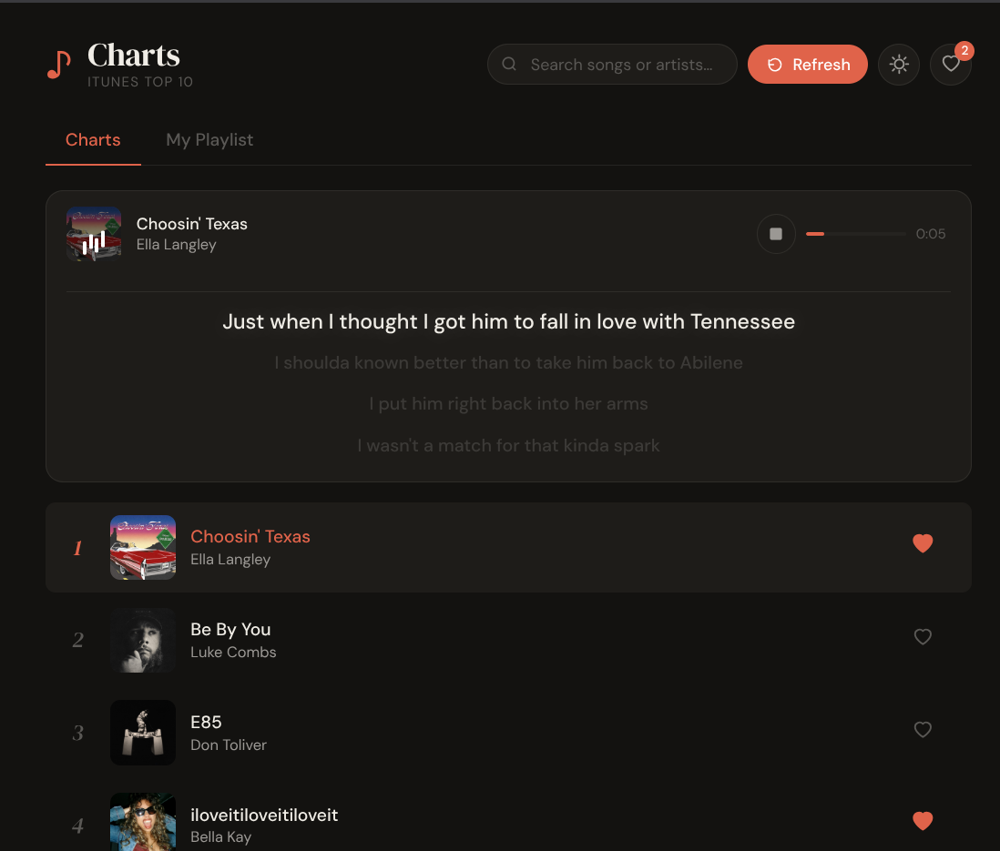
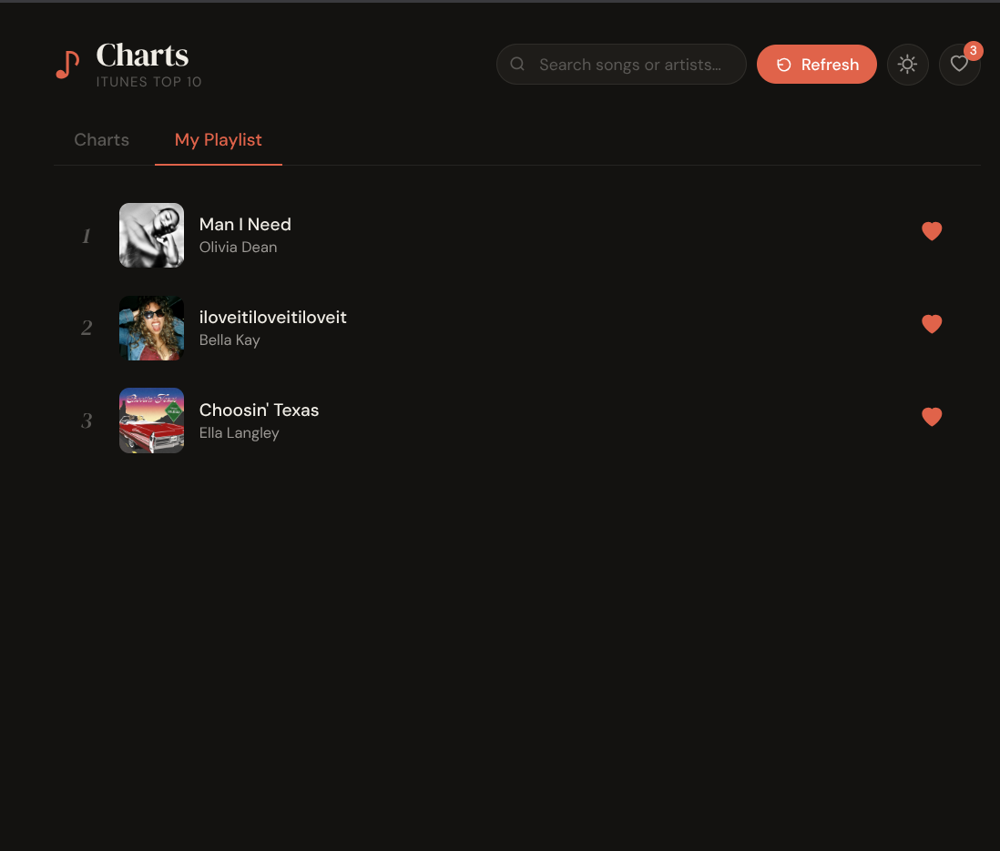

# 🎵 Music Selector v2

A modern, high-performance music curation application. **Music Selector v2** upgrades the original concept with a robust layered backend, real-time audio previews, persistent user favorites, and a sleek dual-theme interface.

---


## 🌟 Key Features

| Feature | Description |
| :--- | :--- |
| **🎧 Audio Previews** | High-quality 30s previews sourced directly from the iTunes Lookup API. |
| **❤️ Persistent Favorites** | Like tracks and have them saved instantly to a MongoDB cluster. |
| **🔍 Smart Filter** | Debounced client-side filtering + backend text indexing for lightning-fast search. |
| **🌓 Dynamic Themes** | Intelligent Dark/Light mode detection with custom UI transitions. |
| **⚡ Layered Backend** | Production-ready architecture: Routes → Services → Models. |
| **🐳 Dockerized** | Fully containerized environment for seamless deployment and consistency. |

---

## 🛠️ Tech Stack

- **Frontend**: [Vite](https://vitejs.dev/) (Vanilla JS), HTML5, CSS3 Custom Properties.
- **Backend**: [Node.js](https://nodejs.org/) 20, [Express](https://expressjs.com/), Axios, XML2JS.
- **Database**: [MongoDB](https://www.mongodb.com/) 7 + [Mongoose](https://mongoosejs.com/).
- **DevOps**: Docker, Docker Compose, GNU Make.

---

## 🚀 Quick Start

Ensure you have **Docker**, **Docker Compose**, and **Node.js** installed.

### Development Environment (Recommended)
This mode runs the Backend and MongoDB in Docker, while the Frontend uses Vite's Hot Module Replacement (HMR) for instant updates.

```bash
make dev
```

- **Frontend**: [http://localhost:5173](http://localhost:5173)
- **Backend API**: [http://localhost:5000](http://localhost:5000)

### Production Build
Builds the frontend minified assets and serves everything from the Express backend.

```bash
make build
```
- **Live App**: [http://localhost:5000](http://localhost:5000)

---

## 📂 Project Structure

```bash
music-selector-v2/
├── backend/            # Express.js layered server
│   ├── app/           # App factory & central middleware
│   ├── config/        # Environment & config management
│   ├── database/      # Mongoose connection logic
│   ├── models/        # Data schemas (Songs, Favorites)
│   ├── routes/        # API endpoint definitions
│   └── services/      # External API (Apple) & business logic
├── frontend/           # Vite/Vanilla JS application
│   ├── apiClient.js   # Reusable fetch wrappers
│   ├── ui.js          # Modular DOM rendering
│   └── main.js        # State orchestration & event handling
├── docker-compose.yml  # Multi-container orchestration
└── Makefile            # Developer automation scripts
```

---

## 🔌 API Endpoints

| Method | Path | Description |
| :--- | :--- | :--- |
| `GET` | `/songs` | Retrieves cached songs from MongoDB. Supports `?search=`. |
| `GET` | `/songs/fetch` | Live sync from Apple RSS + iTunes Lookup enrichment. |
| `GET` | `/favorites` | Returns the user's saved track list. |
| `POST` | `/favorites` | Persists a track to the favorites collection. |
| `DELETE` | `/favorites/:id`| Removes a track from favorites. |
| `GET` | `/health` | Server status check. |

---

## 📜 Automation (Makefile)

| Target | Action |
| :--- | :--- |
| `make dev` | Spins up Backend/DB containers and Frontend dev server. |
| `make build` | Generates frontend `dist/` and runs production stack. |
| `make up` | Starts Docker containers in the background. |
| `make down` | Gracefully stops all project containers. |
| `make logs` | Streams backend logs for debugging. |
| `make clean` | Wipes containers, volumes, and `node_modules`. |

---

## 🤝 Documentation
For deeper dives into how the app works:
- 📖 [**App Workflow**](./APP_WORKFLOW.md) – End-to-end data and API cycle.
- 📂 [**File Explorer**](./PROJECT_FILES.md) – Explanation of every source file.
